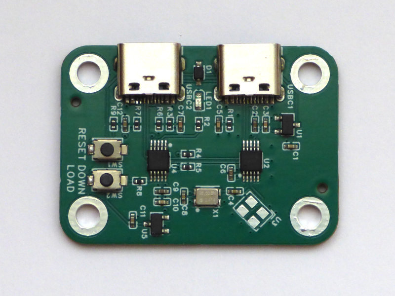

# SI5351 Clock Generator

[](pictures/si5251-clock.png)

With this board you always have a crystal with the frequency you need.

This is a clock generator with an output range of 8 kHz to 200 MHz. Output voltage levels is 3.3V or 1.8V. Four power levels are available, from 2mA to 8mA into a 50 ohm load. A usb serial console is used to set desired frequency and power level.

##  Description
The board has two usb-c connectors, one labeled "usb" and one labeled "clock out". Connect the usb-c connector labeled "usb" to a pc to set clock frequency. The clock signals are output on the usb-c connector labeled "clock out", pins D+ and D-.

Connect the usb-c port labeled "usb" to a pc. A usb serial port appears on the pc. Connect a vt100 terminal (putty on Windows, minicom on linux) to the usb serial port.

```
si5351 clock gen
? for help

0 8MHz 8mA
1 32768Hz 6mA
clock 0 >
```

To obtain a command summary, type '?'
```text
crystal 26000000 Hz
0..9,backspace: frequency
enter: set Hz
k: set kHz
m: set MHz
+,-: power up/down
a: select clock 0
b: select clock 1
s: store
r: recall
t: self-test
?,h: help
```

To set the frequency, enter a number, optionally followed by k for kHz or m for MHz.

|Type|frequency|
|---|---|
|12345 Enter|12345 Hz|
|12k|12 kHz|
|12m| 12 MHz|

Four output levels are available: 2mA, 4mA, 6mA and 8mA. (This is mA current into a 50 ohm load). Typing '+' increases power. Typing '-' decreases power.

To change the frequency and power of the second clock, first type 'b'. To go back to changing the frequency and power of the second clock, first type 'a'.

To save frequency and power settings, type 's'. Next time the clock generator is switched on, frequency and power will be restored.

To recall last saved frequency and power settings immediately, type 'r'.

To run a self-test, type 't'. Self-test will do a frequency sweep from 8kHz to 200MHz, and print "ok" or "failed". If the PLL's in the SI5351 lock for every frequency of the sweep, self-test will print "ok". If the PLL's in the SI5351 lose lock during the sweep, self-test will print "failed".

The LED blinks if an error occurs.

## Notes

Cut a usb-c cable in two to connect the clock generator to a dev board.

When feeding a clock signal to STM32-like processors, consider setting STM32 HSE or LSE to "[Bypass clock source](https://community.st.com/t5/stm32-mcus/how-to-use-stm32cubemx-to-configure-hse-high-speed-external/ta-p/49604)".

Also, depending upon frequency and circuit, consider adding a terminating resistor (example: 50 ohm) or a DC-blocking capacitor (example: 100nF).

## Hardware

The hardware is a MS5351M / SI5351 clock generator and a WCH CH552E controller. The hardware supports generating two single-ended clock outputs, or one differential clock output.

Frequency source is a 26MHz 0.5ppm  Temperature Compensated Crystal Oscillator (TCXO). If high accuracy is not needed, a 25MHz 10ppm crystal can be used instead.

The voltage regulator labeled "VDDO" determines output voltage. Choose between 3.3V and 1.8V voltage regulators.

The clock generator can be powered from the "usb" or from the "clock out" port.

The  [hardware design ](https://oshwlab.com/koendv/si5351-clock) is open source. The boards were assembled at jlcpcb.

## Software

The CH552E is a 24MHz 8051 with 16 kbyte flash, 1 kbyte ram, and built-in usb. This is enough for many things. A small c program runs the usb serial console and configures the clock generator using I2C. Use [ch55xduino](https://github.com/DeqingSun/ch55xduino) to compile.

Crystal frequency and crystal capacitance are hardcoded in the source code. If the crystal is changed, the source code has to be changed, too.

The software configures two clocks with frequencies between 8 kHz and 200MHz.

Program source and compiled firmware are on [github](https://github.com/koendv/si5351-clock)

## Compiled binary

Firmware can be uploaded using  [the command line](https://hackaday.io/page/137447-flashing-the-ch552-dev-board-from-the-command-line):

- Disconnect the clock generator from usb
- Press button "Download"
- With button "Download" pressed, connect the clock generator to usb
- Wait one second
- Release button "Download"
- Run ```vnproch55x -r 16 -t CH552 si5351-clock.ino.hex```

vnproch55x [binaries](https://github.com/DeqingSun/ch55xduino/tree/ch55xduino/ch55xduino/tools) and [source](https://github.com/DeqingSun/vnproch551)

## Conclusion

A clock generator is presented with good accuracy and temperature stability, a wide frequency range, and low cost. The clock generator is a small, self-contained device, that needs no external software to use.

*not truncated*
